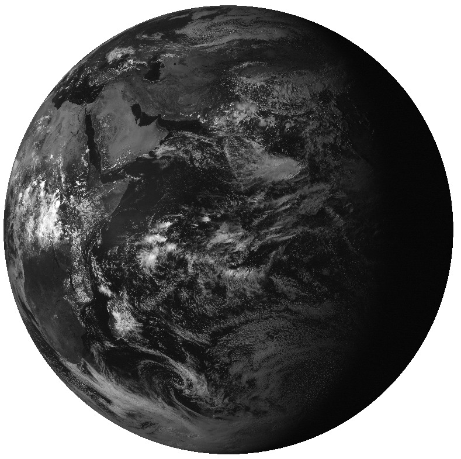
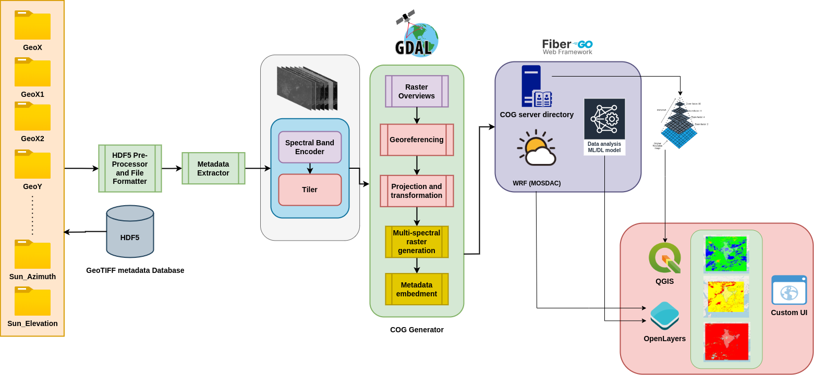
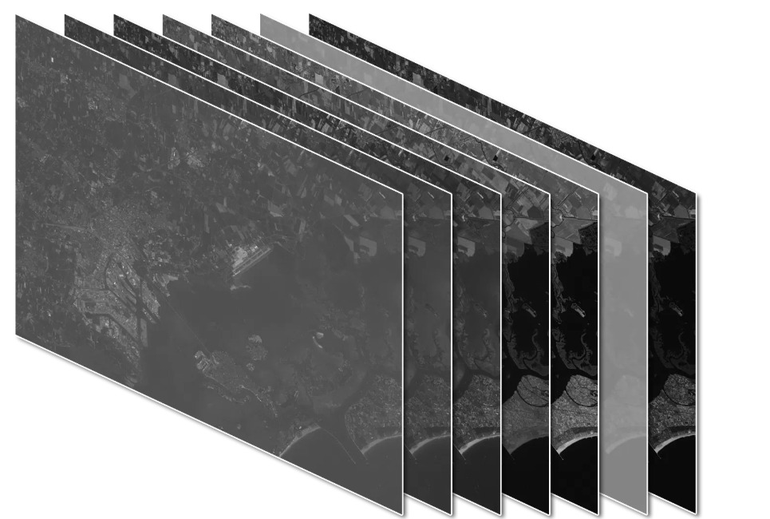
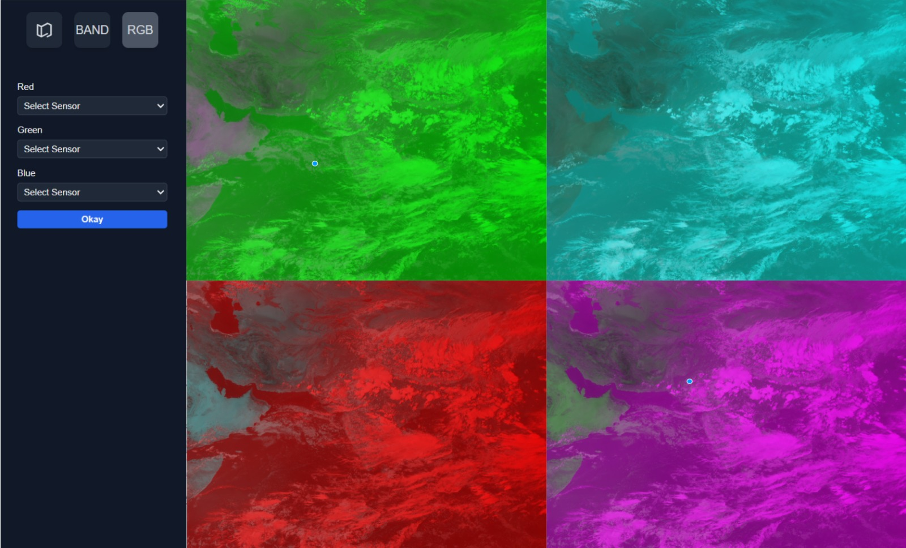
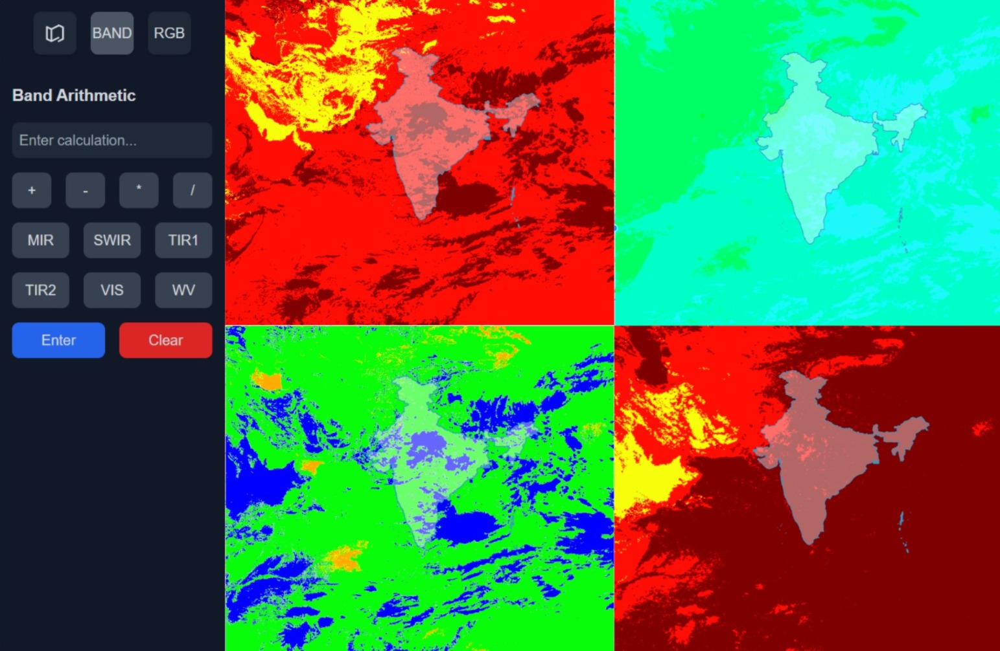
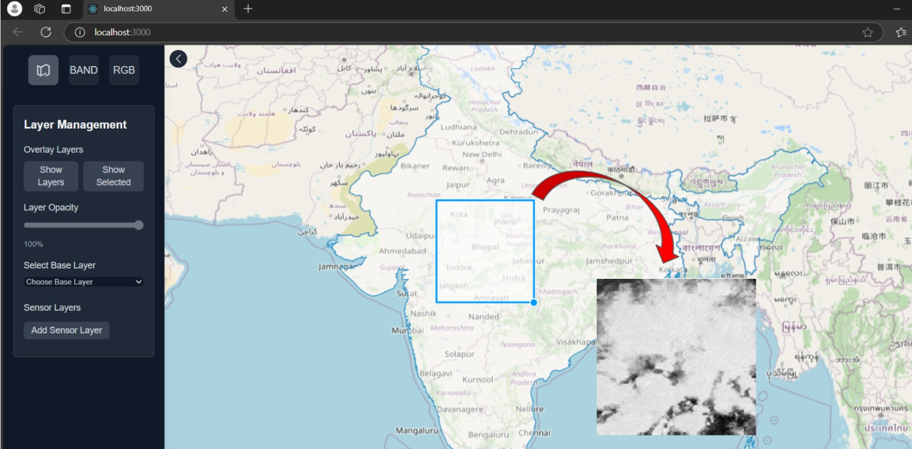

# COG
This is our submission to the [Smart India Hackathon (2024)](https://www.sih.gov.in/) under the [Indian Space Research Organisation(ISRO)](https://www.isro.gov.in/), Department of Space.
## Problem statement and objectives
1. To Develop an application compatible with Cloud Optimized GeoTIFFs
(COG) to enable efficient streaming and real-time processing of INSAT
satellite data.
2. To preprocess Level 1 INSAT data for COG
compatibility.
3. To Create real-time tools for band arithmetic, color
adjustments, and custom visualizations with an
intuitive user interface.
4. To Develop a pipeline and driver to convert
INSAT data into multi-band COGs, enabling
efficient encoding, selective streaming, and
partial downloads.
### Level 1 INSAT-3DR data

Level 1 data is categorized into L1B and L1C (which has an area of interest over the Indian Subcontinent). The image shown above is of L1B.

#### Characteristics of Level 1 INSAT Data:
##### Projection:
The data is in a raw projection and has been georeferenced to a standard map projection (e.g., latitude-longitude grid). The data should further be processed into a Mercator projection before being converted into COG.

##### Sensor-Specific Details:

INSAT satellites carry payloads like IMAGER (for visible, infrared, and thermal imaging) and SOUNDERS (for atmospheric soundings). Level 1 data includes:
Individual spectral band data (e.g., visible, infrared, water vapor).

**We will be dealing with only the IMAGER sensors which are mainly:**
- IMG_MIR (Mid-Infrared)
- IMG_SWIR (Shortwave-Infrared)
- IMG_TIR1 (Thermal-Infrared 1)
- IMG_TIR2 (Thermal-Infrared 2)
- IMG_VIS (Visual)
- IMG_WV (Water Vapour)

Metadata about acquisition time, geographic coverage, and satellite/sensor details are all contained in a HDF5 file format.

## Our Application 




## Backend and COG driver
Our application consists of a Go and C-based backend for generating COGs and hosting them on a file server on an IP:PORT. We use GDAL for preprocessing and generating COGs with C which is internally called with the Go-C API bindings when a new HDF5 file gets read. We also have Python scripts for conversions, however, they are not recommended for high-performance use cases on the cloud.


After preprocessing the data, the driver stacks multiple spectral bands of the satellite IMAGER sensor into a single COG file.

### Creating and activating a virtual environment 
```bash
python -m venv venv
source venv/bin/activate
```
### Installing dependencies
```bash
pip install -r requirements.txt
```

### Setting up GDAL 

```bash
pip install numpy>2.0.0 wheel setuptools>=67
pip install gdal[numpy]=="$(gdal-config --version).*"
```
or 
```bash
pip install --no-cache --force-reinstall gdal[numpy]=="$(gdal-config --version).*"
```
## Frontend Web Application
Our Frontend web application supports various features listed below. A user can query based on date and time to retrieve the level 1 data from the INSAT directory. Further, they can choose the bands of interest and operate on them as per their wish.

### RGB Channels
RGB channels are often used to visualize and interpret multispectral data. The three primary colors in the visible spectrum **Red, Green, and Blue** are combined to create a composite image, providing a way to visualize various features on the Earth's surface based on their reflectance in these wavelengths.

For satellite data such as INSAT imagery, different spectral bands capture specific wavelengths of light, ranging from visible to infrared regions. By appropriately assigning these bands to the Red (R), Green (G), and Blue (B) channels, we can create meaningful visualizations that highlight key features, such as vegetation, water bodies, and urban areas.




### Band Arithmetic
Band arithmetic refers to mathematical operations applied to multiple spectral bands to derive new information or highlight specific features in remote sensing data. By combining bands through arithmetic operations, we can enhance specific characteristics of the Earth's surface, such as vegetation health, water bodies, or soil moisture, that may not be immediately visible in individual spectral bands. We provide **custom user-defined band arithmetic function** support for researchers in our application. With a calculator like UI, you can specify arithemtic operations on bands and see the results.




### Partial Download
Partial download is a feature to access only specific regions or portions of a larger COG file without downloading the entire file. This capability is especially useful when working with large INSAT COG files like the L1B data, where downloading the entire file can be resource-intensive and time-consuming. By enabling partial downloads in our application, users can significantly reduce bandwidth usage, storage requirements, and processing time, while still obtaining the specific data they need for their analysis.




